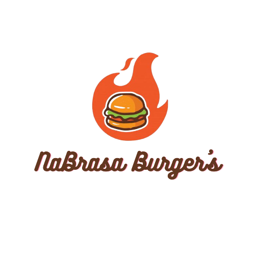
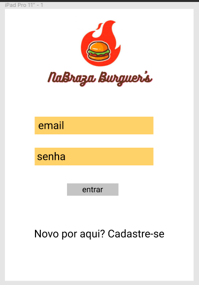
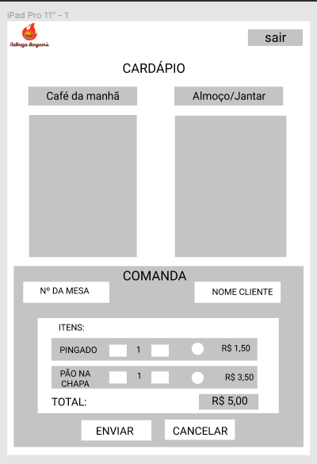
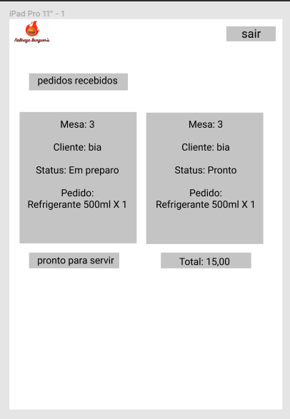

## Índice

- [1. Introdução](#1-introdução)
- [2. Sobre o NaBrasa](#2-sobre-o-nabrasa)
- [3. Histórias de Usuários](#3-histórias-de-usuários)
- [4. Planejamento e Organização](#4-planejamento-e-organização)
- [5. Tecnologias Utilizadas](#5-tecnologias-utilizadas)
- [6. Implementações Futuras](#6-implementações-futuras)
- [7. Desenolvedoras](#7-desenvolvedoras)

---

## 1. Introdução

Projeto realizado durante o [Bootcamp Laboratória](https://github.com/Laboratoria) onde foi proposto o desafio de criar uma aplicação 100% por demanda para uma hamburgueria em crescimento. Desenvolvemos uma aplicação responsiva para Tablet responsável por fazer a gestão da hamburgueria de forma sincronizada e eficiente entre os setores de salão e cozinha

---

## 2. Sobre o NaBrasa

O nome **NaBrasa** foi criado com a intenção de mexer com o psicológico do cliente, de poder sentir o gosto e o cheiro de um hambúrguer 
grelhado apenas lendo o nome do restaurante.

O logo sendo um lanche dentro de uma brasa também contribui bastante para reforçar a identidade visual.

Inicialmente, utilizaríamos a grafia desta marca como "Braza" para ser um diferencial, mas após feedback de nossos usuários, decidimos por 
utilizar a palavra com sua grafia usual, pois o significado remete exatamente a idéia inicial, da carne suculenta e gostosa na grelha.

[Clique aqui](https://nabrasaburger.vercel.app/) para conhecer NaBrasa! :fire:

---

## 3. Histórias de Usuários

Trabalhamos durante 4 sprints de acordo com as Histórias de Usuários fornecidas pelo _Product Owner_:

### História de usuário 1: Criar perfil

- [ ] Poder realizar cadastro com e-mail, senha e função.
- [ ] Poder realizar login com e-mail e senha.
- [ ] Redirecionar para a tela correta.

### História de usuário 2: Anotar pedidos

- [ ] Digitar o nome do cliente e mesa.
- [ ] Filtrar _menu_ para _café da manhã_ e _almoço/jantar_.
- [ ] Adicionar item ao pedido.
- [ ] Excluir item do pedido.
- [ ] Mostrar _resumo_ do pedido com todos os itens e o total.
- [ ] Enviar para a cozinha (isso deve salvar o pedido).

### História de usuário 3: Ver pedidos na cozinha

- [ ] Visualizar pedidos pendentes para produção.
- [ ] Marcar pedido como pronto para entrega.
- [ ] Ver histórico dos pedidos

### História de usuário 4: Entrega de pedidos

- [ ] Visualizar pedidos pendentes para entrega.
- [ ] Marcar pedido como entregue ao cliente.

---

## 4. Planejamento e Organização

Nosso planejamento foi feito a partir da ferramenta Trello, pela metodologia Kanban, onde dividimos e entregamos cada história por sprint.
Para ver nosso quadro [acesse aqui](https://trello.com/b/WvTApf0S/nabrasa-burguers).

### Protótipos

De acordo com as necessidades de nosso cliente, desenvolvemos protótipos de média fidelidade para guiar no processo de criação deste WebApp.

_Login_

_Registro_

_Cardápio_

_Pedidos_

### Paleta de Cores

Para reforçar cada vez mais a identidade do NaBrasa, utilizamos o logo como referência para criar a paleta de cores a ser utilizada em nossas telas:

---

## 5. Tecnologias Utilizadas

- HTML;
- CSS;
- JavaScript;
- React;
- Consumo de API;
- Insomnia;
- Figma;
- Canva;
- Vercel.

---

## 6. Implementações Futuras

As melhorias que gostaríamos de implementar nesta aplicação seriam:

* Incluir filtro para os Hamburgueres (Vegano/Carne/Frango);
* Incluir modal para os ingredientes adicionais (Ovo/Queijo);
* Criar um arquivo para armazenar os pedidos já finalizados.

---

## 7. Desenvolvedoras

Este projeto foi desenvolvido por [Camila Kikuchi](https://github.com/CamilaKikuchi), [Giovana Madeira](https://github.com/giomadeira) e [Juliana Souza](https://github.com/julianaads) :rocket:

---

